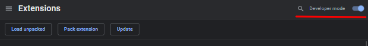

# Personal Dashboard (Momentum Clone)
## Scrimba code along project

I have added a few further options to the dashboard to make it more like Momentum.

Includes:

- Current bitcoin, ethereum and tether price.
- Live weather (will require access to your location)
- Today's Focus
- One click 12/24 Hour Time Format with corresponding greetings message
- Live background using Unsplash API with a link to particular image @unsplash.
- Random Quote Display
- Todos with local storage.

It uses local storage for name, todos, and today's focus.

Here is how to set this up as chrome extension:

1. Type **chrome://extensions/** in chrome addressbar and press enter.
2. Make sure developer mode (top right) is cheked and click load unpacked.
3. Locate and select the folder which includes the code.

This was an awesome project taught by [Bob Ziroll](https://github.com/bobziroll) from scrimba's [Front-end Developer Career Path](https://scrimba.com/learn/frontend).
